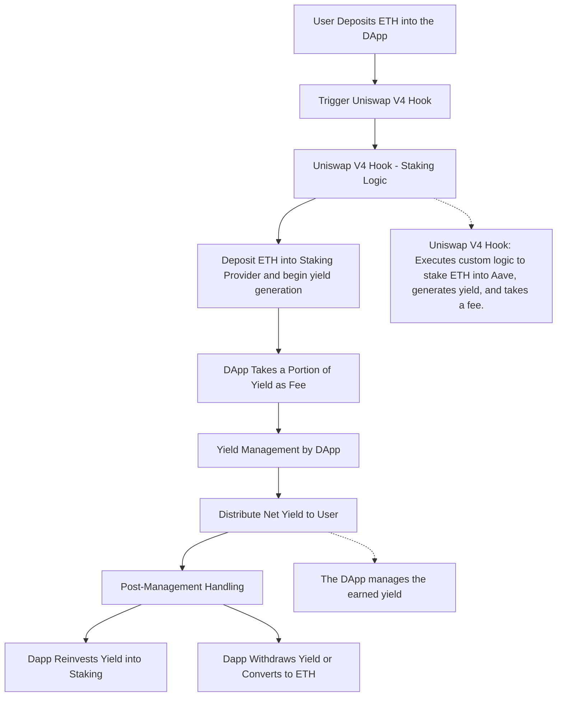

# almost-free-lunch-v4-hook
Almost Free Lunch Uniswap v4 Hook for earning passive yield on unallocated funds

### Flowchart

```mermaid
flowchart TB
    %% This Hook alows Dapps to eat off of the assets in there contract
    %% User Interaction Flow
    A[User Deposits ETH into the DApp]
    A1[Trigger Uniswap V4 Hook]
    A --> A1

    %% Uniswap V4 Hook Execution
    B[Uniswap V4 Hook - Staking Logic ]
    B1[Deposit ETH into Staking Provider and begin yield generation]
    B2[DApp Takes a Portion of Yield as Fee]
    A1 --> B --> B1 --> B2

    %% Yield Management
    C[Yield Management by DApp]
    C1[Distribute Net Yield to User]
    B2 --> C --> C1

    %% Post-Management Options
    D[Post-Management Handling]
    D1[Dapp Reinvests Yield into Staking]
    D2[Dapp Withdraws Yield or Converts to ETH]
    C1 --> D --> D1 & D2

    %% Annotations for Clarification
    note1["Uniswap V4 Hook: Executes custom logic to stake ETH into Aave, generates yield, and takes a fee."]
    B -.-> note1
    note2["The DApp manages the earned yield"]
    C1 -.-> note2
```
